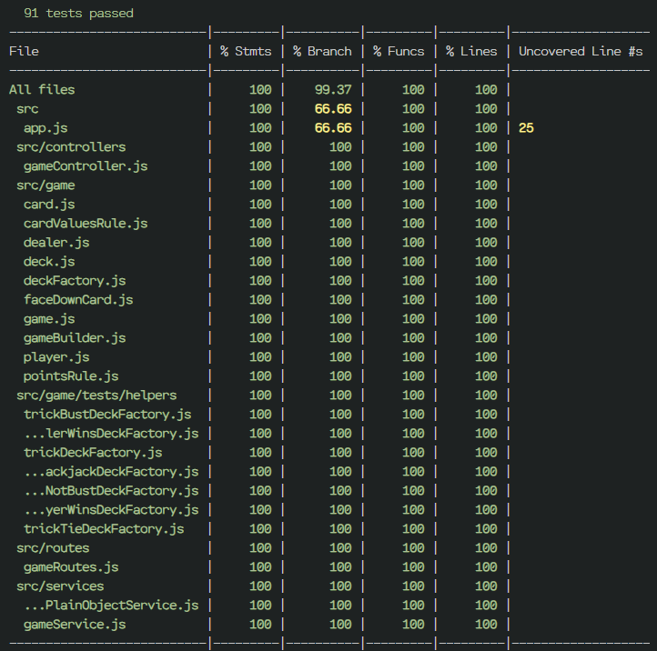

## Running the app

This app was made with `node v20.12.1`.

As you can see in `.env.example`, there are 3 env variables to set in `.env`:

- `DEBUG_LEVEL` is the level of detail you want to see in the server log. `info` means one simple line for each request, while `debug` shows detailed information of each request.
- `PORT` is the port the server will be listening to.
- `SESSION_SECRET` is the secret to initialize the session.

Once the env vars are set, run the following command:

```bash
npm start
```

## Testing

To run tests and coverage:

```bash
npm run test:coverage
```

Here's a screenshot of the coverage:



## Further improvements

- To improve the OOP solution and avoid possible errors, I would use TypeScript.
- The session structure is super basic, so it could be improved.
- Related to the previous point, a simple auth with JWT could be added to improve security.
- Some edge cases may be missing from exception catching.
